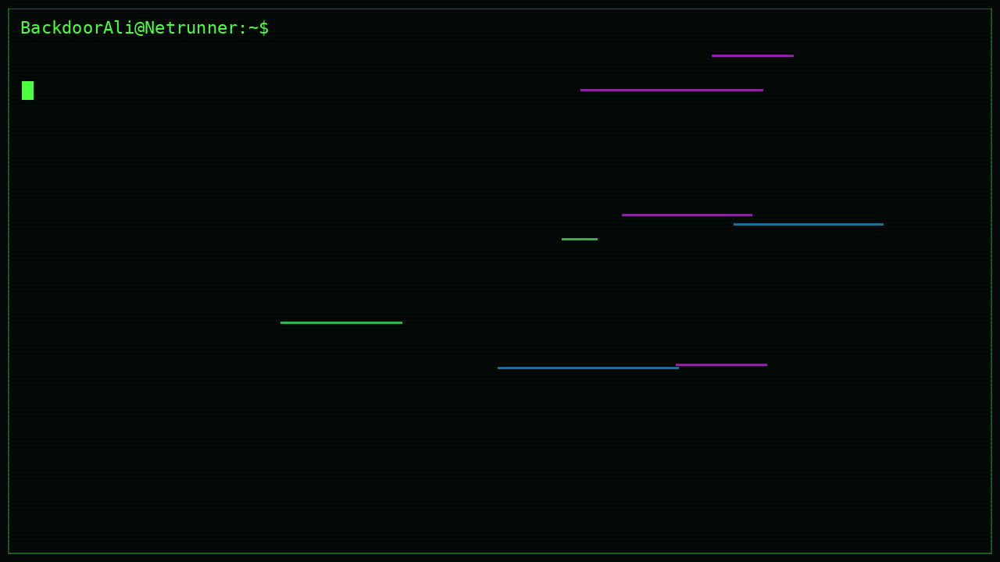

  

  

<h2 align="center">Programming Languages</h2>

  
  
  
  
  
  
  
  

<h2 align="center">Software & Gadgets</h2>

<h3 align="center">Operating Systems & Virtualisation</h3>

  
  
  
  
  

  
  
  
  
  

 

<h3 align="center">Hak5 Software</h3>

  
  
  

 

<h3 align="center">Security Platforms & Tools</h3>

  
  
  
  
  

  
  
  
  

 

<h3 align="center">Bug Bounty & Security Platforms</h3>

  
  
  
  

 

<h3 align="center">Gadgets</h3>

  
  
  

  
  
  

  
  
  

  
  

<h2 align="center">Libraries & Machine Learning</h2>

  
  
  
  

  
  
  
  

  

<h2 align="center">AI & Security</h2>

  
  
  

  
  
  

  
  
  

  

  

<h2 align="center">Certifications</h2>

  
  

  
  

  

